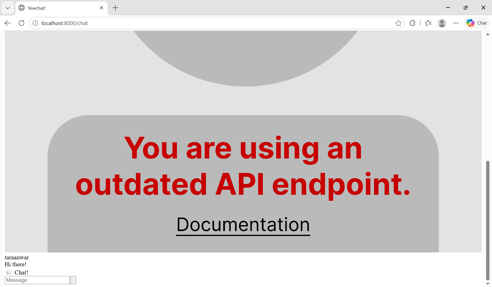
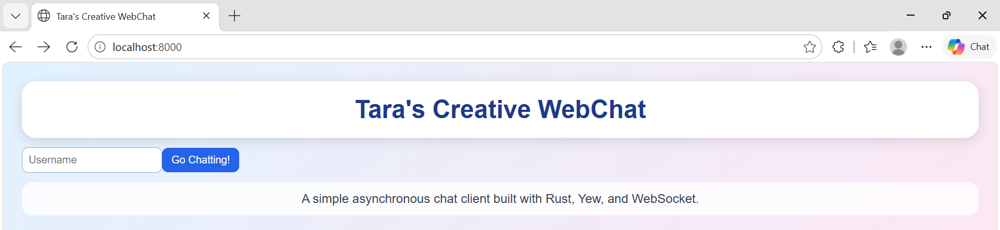

# Module 10 - Tutorial 3: WebChat using Yew

## Experiment 3.1: Original code

In this experiment, I cloned and ran the original YewChat web client and its websocket server. The websocket server was started first because the web client needs a running websocket server to connect to. After that, I ran the YewChat client in the browser. The original webpack setup had compatibility issues with the current Rust and WebAssembly tooling, so I used `wasm-pack` to build the web client and served the generated files locally. The web client opens in the browser and allows the user to enter a username before going to the chat page. This experiment shows how a browser-based chat client can communicate with a websocket server asynchronously.

## Experiment 3.2: Be Creative!

In this experiment, I added a creative visual theme to the YewChat web client. I changed the page title to `Tara's Creative WebChat` and added a colorful gradient background. I also added a large banner using CSS so the web client looks more personal and recognizable. The input and button styles were improved with rounded corners and cleaner colors. This change does not modify the websocket logic, so the original chat functionality still works normally. This creative modification focuses on improving the appearance of the web client while keeping the original YewChat behavior.
